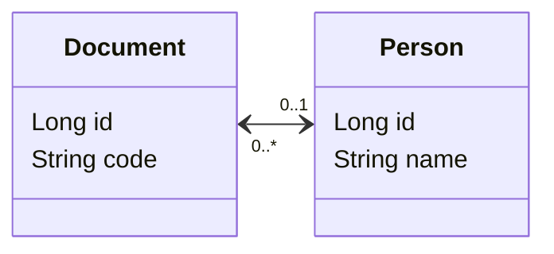
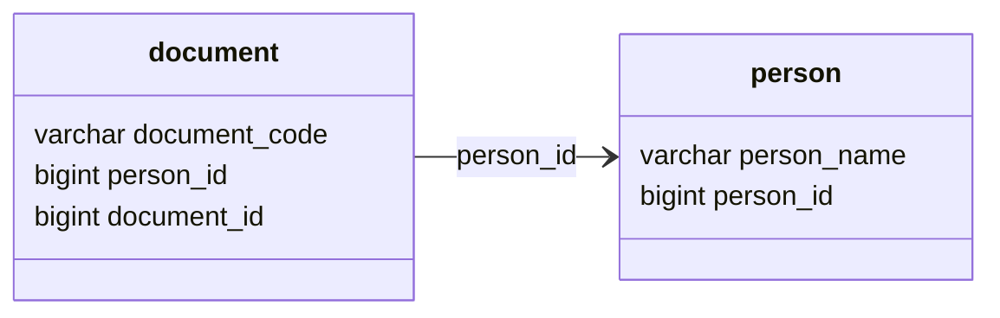

# POC: JPA One-to-Many Bidirectional

It demonstrates how to use JPA to implement one-to-many relationship.

The goal is to be able to persist information about people, documents and links between them. Every person must have one
or none document registered, and we want to make the references consistent.

In this example the `Document` entity is the owner of the relationship and contains a reference to the `Person` it
belongs to with a field annotated with `ManyToOne` and `JoinColumn` referencing the primary they of the owner entity.
The `Person` entity has a lazy-loaded reference of all documents assigned to its primary key, which is annotated
with `OneToMany` and specifies which field of the owner entity is responsible to map it.

## How to run

| Description | Command          |
|:------------|:-----------------|
| Run tests   | `./gradlew test` |

## Preview

Entity Relationship Model:

Database schema:

